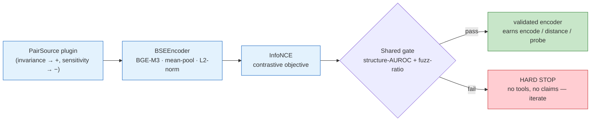
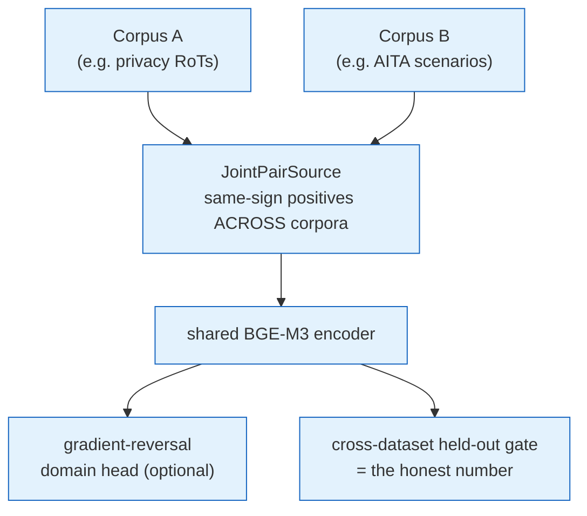

# xbse — modular domain-specific sentence embeddings, validated by one shared gate

[](https://github.com/ahb-sjsu/xbse/actions/workflows/ci.yml)
[](https://pypi.org/project/xbse/)
[](https://pypi.org/project/xbse/)
[](LICENSE)
[](https://github.com/psf/black)
[](https://github.com/astral-sh/ruff)
[](https://github.com/astral-sh/ty)
[](https://github.com/pre-commit/pre-commit)
[](https://docs.pytest.org)

## Abstract

**xbse** trains and — more importantly — *validates* small, specialized text encoders, one per
moral dimension (physical harm, fairness, privacy, honesty, autonomy, …). Each encoder turns a
sentence into a signed score for its dimension: *how much does this text uphold or violate this
value?* These encoders are the **perception layer of a larger AI-ethics engine** (DEME / `erisml`):
every number that engine reasons over has to come from somewhere, and xbse is where it comes from.

The distinctive contribution is not the encoders but the **discipline around them**. One shared,
adversarial validation gate every encoder must clear; pass/fail **bars derived from the data and
pre-registered before results are seen**; a hard rule that an unvalidated encoder cannot be used
downstream; and validation provenance carried into the ethics engine's cryptographic audit trail.
On a held-out **cross-dataset** test — the honest measure of whether an encoder learned a
*transferable* moral concept instead of one dataset's vocabulary — **8 of 9 dimensions clear their
pre-registered bar**, beating both an untrained baseline and a bag-of-words control by wide margins
(+0.16 to +0.33 AUROC). The 9th (`rights_respect`) fails, and the framework reports it as failed.

## What this is, in plain terms

AI systems that make or assist moral decisions must *read* a situation and notice things like "this
harms someone," "this is unfair," "this exposes private information." A **sentence-embedding
encoder** is a model that turns text into a list of numbers (a vector) capturing its meaning, so
that texts meaning similar things get similar vectors. xbse builds one such encoder **per moral
concept**, tuned so the vector captures *that concept's* valence — is the value upheld or violated?
— while ignoring surface details like wording or topic.

The hard part isn't building an encoder; it's **knowing whether to trust it**. An encoder can look
excellent on its training data yet be worthless on anything new, because it memorized that dataset's
vocabulary rather than the moral idea. xbse's core contribution is a validation regime built to
catch exactly that: it tests every encoder on a *second, independent* dataset; it compares the
encoder against a deliberately "dumb" bag-of-words model to prove it learned *meaning*, not just
*words*; and it refuses to use any encoder until it clears a pass mark written down **before** the
results were seen. When an encoder fails, the framework says so. Because this is the perception
layer of a safety-critical ethics engine, that honesty is the whole point.

## For practitioners

`*-BSE` models (LaBSE, LeBSE, MoBSE, …) are the *same architecture* trained to be **invariant to
one axis** and **sensitive to another**. `xbse` factors out everything they share and leaves each
domain as a small plugin — a new `*-BSE` is a `PairSource` + a config, not a new repo — and **every
instance clears the same validation gate**, so no encoder can grade itself easier than another.

Each *moral* `*-BSE` is the encoder for one **DEME MoralVector** dimension; the dimension↔feeder map
lives in `erisml-lib/docs/moralvector_reference.md`.

## The idea in one table

| model | invariance (→ positives) | sensitivity (→ negatives) |
|---|---|---|
| LaBSE | language (translation pairs) | meaning |
| LeBSE | surface / citation form | legal holding |
| **MoralVector feeders** | wording / framing / topic / **which corpus** | one moral dimension's valence |

Only the **PairSource** (what is invariant vs sensitive), an optional **domain adversary**, and the
**validation labels** differ. The encoder, contrastive objective, and gate are written once.

## Architecture



```
xbse/
  encoder.py        BSEEncoder: base transformer → pooling → projection → L2-norm   (shared)
  pairs.py          PairSource ABC yielding (anchor, positive, negative)            (shared iface)
  objective.py      InfoNCE contrastive loss                                        (shared)
  adversarial.py    gradient-reversal domain head + polar severity readout          (shared)
  validate.py       THE GATE: structure-vs-surface AUROC + fuzz ratio               (shared)
  train.py          single-corpus training loop                                     (shared)
  train_adv.py      joint cross-dataset + domain-adversarial loop                   (shared)
  instances/
    joint.py          JointPairSource — train one dimension on ≥2 corpora at once
    joint_builders.py per-dimension corpus assembly (privacy, care, rights, …)
    mobse.py rights.py physharm.py epistemic.py socenv.py privacybse.py darkpattern.py …
  experiments/
    data_sourcing_plan.md    ≥2 independent corpora per dimension (+ legal-evidence route, APIs)
    rank_test.py             empirical moral-dimension rank test (bifactor result)
```

## Why cross-dataset validation — the correction that reshaped this project

Single-corpus contrastive fine-tuning of BGE-M3 learns a corpus's **surface**, because that is the
easiest way to separate its pairs. A feeder can score a beautiful **within-dataset** AUROC yet have
learned nothing transferable. We proved this the hard way: every moral feeder scored 0.75–0.955
within its own corpus but **collapsed to ~0.47–0.55 (random) on a second, independent corpus of the
same dimension.** The within-dataset numbers were artifacts.

**The fix — joint cross-dataset training** (`JointPairSource`): train each dimension on **≥2 corpora
at once**, drawing every same-sign positive from a *different* corpus. To pull an A-text next to a
same-valence B-text the encoder cannot use A's surface — only the shared moral structure. Held-out
AUROC is then cross-dataset **by construction**. An optional gradient-reversal domain head
(`adversarial.py`) adds explicit corpus-invariance.



## Status — honest cross-dataset scorecard

Cross-dataset held-out AUROC (evaluate on a *second* corpus). `BoW` is a TF-IDF bag-of-words model
on the **same** held-out pairs — the adversarial lexical control. `margin = encoder − BoW`:

| dimension | corpora (2 independent) | baseline | **cross-dataset** | BoW (lexical) | margin | specificity (gate) |
|---|---|---:|---:|---:|---:|---|
| privacy_protection | privacy RoTs + AITA scenarios | 0.55 | **0.853** | 0.54 | **+0.31** | **own-axis** (+.28) |
| epistemic_quality | Social-Chem honesty + ETHICS | 0.48 | **0.817** | 0.53 | **+0.29** | DEMOTE-to-G (−.07) |
| societal_environmental | ClimateBERT + dual-judged env-claims | 0.43 | **0.817** | 0.48 | **+0.33** | **own-axis** (+.31) |
| virtue_care | Social-Chem care-harm + ETHICS | 0.47 | **0.811** | 0.53 | **+0.28** | DEMOTE-to-G (−.04) |
| fairness_equity | Social-Chem fairness + ETHICS | 0.47 | **0.789** | 0.51 | **+0.28** | DEMOTE-to-G (−.02) |
| autonomy_respect | ec-darkpattern + MentalManip | 0.52 | **0.747** | 0.53 | **+0.22** | **own-axis** (+.17) |
| legitimacy_trust | Social-Chem authority + ETHICS | 0.52 | **0.708** | 0.53 | **+0.18** | DEMOTE-to-G (−.05) |
| physical_harm | BeaverTails + ETHICS-harm | 0.50 | **0.622** | 0.46 | **+0.16** | **own-axis** (+.08) |
| rights_respect | ECHR + CourtListener (R6 rerun) | 0.51 | **0.509** ✗ | 0.48 | **−0.00** | ✗ (method-failure branch open) |

**The adversarial control holds:** bag-of-words is near-random (0.46–0.54) on every dimension, so
the encoder's signal is provably **non-lexical** — it is not learning valence-correlated vocabulary.
This is self-enforcing: `JointPairSource` pairs an anchor from corpus A with a same-sign positive
from corpus B, which share little surface, so BoW is helpless while the encoder must find the shared
moral structure. The 8 rehabilitated dimensions beat BoW by +0.16 to +0.33; rights (−0.01, *below*
BoW) is flagged as the honest failure. `bow_auroc` and `lexical_margin` are standing gate metrics.

**Eight of nine dimensions rehabilitated from artifact to real (0.62–0.85).** `rights_respect` is
the honest exception, and as promised, this README now says so: **the discriminating CourtListener
run landed 2026-07-23 and FAILED — the corpus-choice hypothesis is refuted and the method-failure
branch is open.** The registered experiment paired same-genre court case-facts across
jurisdictions (ECHR ↔ US civil-rights §1983/NOS-440s, both signs both domains — including the
mined rights-RESPECTED holdings the aborted Jul-10 attempt lacked): trained 0.509 vs untrained
null 0.512 (margin −0.003, zero learned structure). The stratified physical-integrity variant
(ECHR Art 2–3 ↔ US excessive-force — the *most* coherent right-type pairing available) did worse:
0.467, below its own untrained baseline. Artifacts: `experiments/rights_r6_summary.json`, the two
FAIL reports alongside it, `.pre_r6.bak` originals on the training host. With corpus choice
eliminated, the live explanations are method-level: statement-level valence contrast may not
capture "a right was violated" (a *verdict about a process*, not a valence of a description), or
rights talk may be inherently G-plus-specifics under this objective. `rights_respect` remains a
hand-specified hard channel in every consumer; any rehabilitation attempt needs a *new registered
method*, not another corpus. Lessons
banked: (i) **within-dataset AUROC is not evidence of a real dimension** — always cross-test;
(ii) the load-bearing fix is **cross-corpus same-sign positives**, not the adversary (which only
de-confounds when the two corpora are surface-similar); (iii) `physical_harm` (0.622) is weakest —
the widest genre gap (QA-pairs vs scenarios). Full roadmap: `experiments/data_sourcing_plan.md`.

> **Specificity label (bifactor readout, `docs/BIFACTOR_READOUT.md`).** This scorecard measures
> validated *transfer*, not validated *specificity*: the published bifactor run shows a strong
> general-valence channel G (itself gate-passing at 0.856) predicts several named axes at ≥ 0.98 on
> independent corpora (care, fairness, legitimacy; epistemic 0.94), while privacy, autonomy, and
> environmental are genuinely specific. Per the pre-registered demotion rule, a standing
> **specificity gate** (`xbse.specificity`, registered margin 0.05) now requires each feeder to beat
> every sibling on its own held-out pairs; the full 12×12 discrimination matrix (11 named axes + G)
> **has now been run** (`experiments/specificity_matrix.json`, verdicts in
> `experiments/specificity_verdicts.json`; Atlas, BGE-M3, held-out pairs, gate metric): **5 axes
> are own-axis** (privacy +.28, environmental +.31, identity_attack +.25, autonomy +.17,
> physical_harm +.08) and **6 DEMOTE to G** (care −.04, fairness −.02, legitimacy −.05,
> epistemic −.07, loyalty −.02, purity −.12 — G beats purity on purity's own pairs by 12 points).
> The G row is bimodal: 0.85–0.94 on demoted axes' pairs, chance (0.43–0.51) on specific ones —
> gate-level confirmation of the A2 residualization through independent math (one divergence:
> identity_attack, gate-specific but A2-mixed; the gate is the registered criterion). **Third-corpus OOD columns** (never-touched corpus per dimension,
> top-3 first) are likewise committed ⚪ per `experiments/data_sourcing_plan.md` — a bar may be
> tightened, never loosened. Per-feeder **calibration** (`xbse.calibration`: split-honest ECE,
> reliability curves, and the registered reliability weight `max(0, 2·AUROC − 1)`) is now wired
> into **all 12 production reports** (`experiments/calibration_summary.json`; held-out ECE
> 0.018–0.101 vs raw up to 0.223); consumers weight decision confidence by it — physharm enters
> at 0.26, loyalty at 0.82.

**Pass/fail is against a per-dimension, pre-registered `Bar`** (`xbse.bar`), *not* a universal 0.97.
A feeder is **VALIDATED iff its cross-dataset AUROC beats BOTH nulls — the untrained-encoder
baseline AND the bag-of-words control — by ≥ 0.10** on the same held-out pairs (`policy =
baseline_relative`). This tests the exact claim a cross-dataset feeder makes, and is immune to a
subtlety that sank the alternative we tried first (a label-noise ceiling): the ceiling is a
*within-corpus* quantity, but the AUROC is a harder *cross-corpus* measurement, so requiring "90% of
the ceiling" unfairly penalizes cross-corpus difficulty the ceiling never modeled. The bar, its two
nulls, its margin, and its date were committed **before** the re-gate — git history is the
pre-registration record; a bar may be tightened, never loosened. Under this policy **8 of 9
dimensions validate** (`rights_respect` fails). The bar provenance (`source`, `derivation`,
`registered`) plus the AUROC, BoW margin, and PASS/FAIL travel into every `Report` and are bound
into the ethics engine's hash-chained audit artifact
(`erisml.ethics.decision_proof.FeederValidationRecord`) — a scored dimension can never silently rest
on an unvalidated encoder.

## The non-negotiable discipline (read before adding code)

Built in **falsification order** with **hard stops** (see `docs/MOBSE_PLAN.md`):

1. **Build** an instance (a `PairSource`).
2. **Validate** on a *second, independent* dataset against the instance's pre-registered `Bar` —
   beat the untrained baseline **and** the bag-of-words control by the registered margin.
   **HARD STOP: fail the gate → no downstream tools, no claims — iterate.**
3. Only a *validated* embedding earns `encode` / `distance` / `probe` — enforced by `require_pass`.
4. Any geometric tool on top is a **pre-registered, falsifiable** hypothesis about the geometry.

**Language discipline:** operations are named for what they *measure*, not for retired claims — a
harm operation computes a *representation-invariant harm ledger*, never a "conserved quantity."

## Quickstart

```bash
pip install -e ".[dev]"          # torch (CPU wheel is fine for tests) + package
pytest -q                        # offline gate/objective/circularity tests
ruff check src tests
```

```python
from xbse.encoder import BSEEncoder
from xbse.instances.joint_builders import build_privacy_joint
from xbse.train_adv import train_adversarial

src = build_privacy_joint()                 # ≥2 corpora, cross-dataset positives
enc = BSEEncoder(base_model="BAAI/bge-m3", max_len=src.max_len, device="cuda")
report = train_adversarial(enc, src, max_steps=1400)   # trains, then RUNS THE GATE
print(report.metrics["structure_auroc"])    # cross-dataset held-out AUROC — the honest number
```

Training a `*-BSE` and reporting its gate number are **one operation** — a run that doesn't end in
gate output is not a finished run.

## Testing & CI

`pytest` runs offline (no model download / network): the gate math, the InfoNCE objective, and the
**circularity guard** (`assert_heldout_disjoint` fails loud if any held-out eval text leaked into
training). CI (`.github/workflows/ci.yml`) runs `ruff` + `pytest` on Python 3.10–3.12.

## Kinship (not merged, on purpose)

`*-BSE` learns **invariance** — it quotients a nuisance group out. Its equivariant cousins
([`latte`](https://github.com/ahb-sjsu/latte), [`arc-equivariant-search`](https://github.com/ahb-sjsu/arc-equivariant-search))
*covary* with a symmetry group. Same principle — a transformation group acts; you either mod it out
(here) or transform with it (there) — different codebase.

## License

Two licenses, split by what the file is.

| What | License | File |
|---|---|---|
| Prose and figures: documentation, articles, papers, notes, figures, data, README | [CC BY 4.0](https://creativecommons.org/licenses/by/4.0/) | `LICENSE-TEXT` |
| Source code: the package, scripts, tools, experiment harnesses, the code in notebooks | [MIT](https://opensource.org/licenses/MIT) | `LICENSE` |

Manuscripts under `paper/` or `papers/` that are submitted, accepted or
published elsewhere are outside both files. They carry the rights their
publisher agreement assigns.
